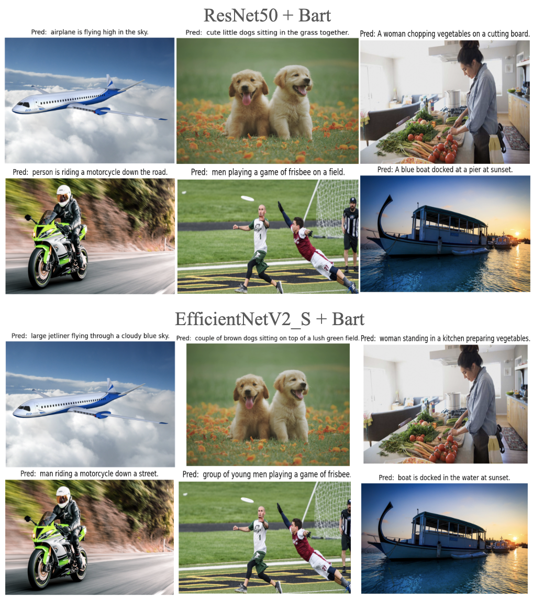
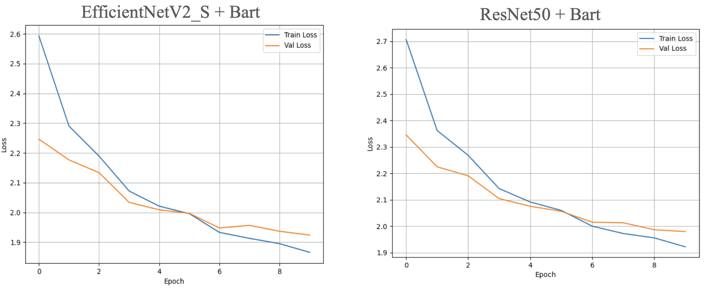
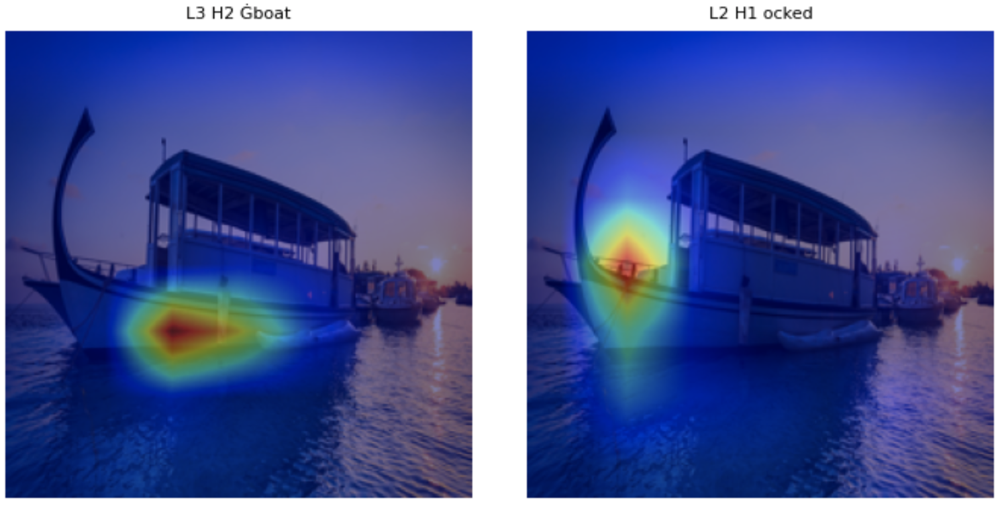

# Image Captioning with CNN and Transformer Decoder (BART)

This repository contains the implementation of a CNN-Transformer architecture for image captioning, combining a CNN-based visual encoder with a BART-based language decoder, along with attention map visualization and analysis of cross-attention between image regions and generated tokens.

## Annotations
Annotation json files for both training and validation set can be found at [Here](http://images.cocodataset.org/annotations/annotations_trainval2017.zip). You will also need to download the entire COCO2017 Dataset, please refer to section in Jupyter Notebook.

## Features

- **CNN Encoders**: ResNet-50 and EfficientNetV2\_S for extracting spatial visual features
- **Transformer Decoder**: Pretrained BART-base model for fluent and contextually relevant caption generation
- **Attention Map Visualization**: Tools to extract and plot cross-attention weights between image features and text tokens
- **Evaluation**: Quantitative metrics (BLEU-4, METEOR) and qualitative examples on the COCO 2017 Captioning dataset

## Repository Structure

```
COMS4995NNDL/
├── annotations/
│   ├── captions_train2017.json
│   ├── captions_val2017.json
│   ├── COCO_caption_dataset.py
│   └── COCO_caption_dataset_bart.py
├── model/
│   ├── encoder/
│   │   └── CNN_encoder.py
│   ├── decoder/
│   │   └── transformer_decoder_layer.py
│   └── caption_models/
│       └── bart_CNN_transformer.py
├── utils/
│   ├── .ipynb_checkpoints/
│   ├── Colab_continue_training_bart.ipynb
│   ├── Colab_training_bart.ipynb
│   ├── Colab_training.ipynb
│   ├── train_bart_caption.py
│   └── train_caption.py
└── readme.md
```

## Installation

**Clone the repository** and checkout the `BART` branch:

   ```bash
   git clone https://github.com/AlexZhu2/COMS4995NNDL.git
   cd COMS4995NNDL
   git checkout BART
   ```

## Notebook Usage

### 1. Setting Environment
We will first introduce how to set up virtual environment and dependencies in able to run our project. You mainly need to use `Colab_continue_training_bart.ipynb` under `utils` directory. We recommend to run this project in Google Colab with at least one Nvidia T4 instance.
#### 1.1 Mount Google Drive
The following code block in `Colab_continue_training_bart.ipynb` is in charge of mounting your Google Drive to store dataset, model checkpoints, training stats, etc.
```python
from google.colab import drive
drive.mount('/content/drive')
```
#### 1.2 Downloading Dataset
> 💡 **Tip:** This step may take a long time.

Then you want to download the training and evaluation dataset through the following code blocks:
```python
!mkdir -p /content/drive/MyDrive/COCO2017/
!wget -nc http://images.cocodataset.org/zips/train2017.zip
!unzip -q train2017.zip
!mv train2017.zip /content/drive/MyDrive/COCO2017/
!wget http://images.cocodataset.org/zips/val2017.zip
!unzip -q val2017.zip
!mv val2017.zip /content/drive/MyDrive/COCO2017/
```
This piece of code will download the dataset and store all the data under your Google Drive at `MyDrive/COCO2017/train2017.zip` and `MyDrive/COCO2017/val2017.zip`. You can choose to run the following code blocks to extract images from the zip files to the Colab runtime for training and validation:
```python
!unzip -q /content/drive/MyDrive/COCO2017/train2017.zip -d /content/
!unzip -q /content/drive/MyDrive/COCO2017/val2017.zip -d /content/
```

#### 1.3 Installing Dependencies
We are using numerous packages that require precise versioning. Please adhere strictly to the version numbers specified in the notebook. To install dependencies:
```python
!pip install torch==2.2.0 torchvision==0.17.0 torchaudio==2.2.0 torchtext==0.17.0 --quiet
!pip install transformers==4.30.2 --quiet
!pip install numpy==1.26.4 --force-reinstall --quiet
```
> ❗ **Important:** You will see warnings during installation, this is **OK**. Please **Restart Session** after all the installations. After restarting the session, make sure sure you have torch version 2.2.0+cu121 and numpy version 1.26.4

#### 1.4 Clone Repository
Clone our repository's BART branch:
```python
!git clone --branch BART https://github.com/AlexZhu2/COMS4995NNDL.git
```
### 2. Training
You may run the code blocks up to the **CONFIG** block. Here you may adjust training settings and where you want to store the training outputs
```python
# ---------------- CONFIG ----------------
DEVICE = torch.device("cuda" if torch.cuda.is_available() else "cpu")
EPOCHS = 20
BATCH_SIZE = 32
EMBED_DIM = 512
MAX_LEN = 35
VAL_SAMPLE_IDX = [0,10,246,93,59]

CHECKPOINT_DIR = "/content/drive/MyDrive/Checkpoints-BART/"
VISUAL_DIR     = "/content/drive/MyDrive/Visualizations-BART/"
STATS_DIR      = "/content/drive/MyDrive/Stats-BART/"

os.makedirs(CHECKPOINT_DIR, exist_ok=True)
os.makedirs(VISUAL_DIR, exist_ok=True)
os.makedirs(STATS_DIR, exist_ok=True)
```

#### 2.1 Model
You may run the script up to **Model** section
```python
# ---------------- MODEL ----------------
model = CNNBARTCaptioningModel(pretrained_model_name="facebook/bart-base", embed_dim=EMBED_DIM, cnn_model_name="efficientnetv2_s").to(DEVICE)
optimizer = optim.Adam(model.parameters(), lr=1e-4)
scheduler = optim.lr_scheduler.StepLR(optimizer, step_size=3, gamma=0.5)
criterion = nn.CrossEntropyLoss(ignore_index=PAD_IDX)

train_losses, val_losses = [], []
best_val_loss = float("inf")
start_epoch = 0
```
You are able to choose 2 CNN backbones `resnet50` or `efficientnetv2_s`, simply pass them in as parameters in `CNNBARTCaptioningModel`, the default CNN backbone is `efficientnetv2_s`. If you do not have an existing checkpoint, you may need to skip `LOAD CHECKPOINT` section.

#### 2.2 Training

These blocks run under `model.train()` and update model parameters:

```python
# Model & Optimization Setup
model = CNNBARTCaptioningModel(embed_dim=EMBED_DIM).to(DEVICE)
optimizer = optim.Adam(model.parameters(), lr=1e-4)
scheduler = optim.lr_scheduler.StepLR(optimizer, step_size=3, gamma=0.5)
criterion = nn.CrossEntropyLoss(ignore_index=PAD_IDX)

# Inside the training loop
model.train()
for batch in train_loader:
    images, captions = ...
    logits = model(images, tgt_input, decoder_attention_mask=attention_mask)
    loss = criterion(
        logits.reshape(-1, VOCAB_SIZE),
        tgt_output.reshape(-1)
    )
    optimizer.zero_grad()
    loss.backward()
    optimizer.step()

# After epoch
scheduler.step()
```
#### 2.3 Validation

These blocks run under `model.eval()` without gradient updates to compute validation loss and save checkpoints:

```python
model.eval()
with torch.no_grad():
    for batch in val_loader:
        images, captions = ...
        logits = model(images, tgt_input, decoder_attention_mask=attention_mask)
        loss = criterion(
            logits.reshape(-1, VOCAB_SIZE),
            tgt_output.reshape(-1)
        )
        total_val_loss += loss.item()
```

### 3. Inference (Qualitative Sampling)

Part of the validation loop that decodes and visualizes sample predictions:

```python
# Inside validation loop, for selected indices
pred_ids = torch.argmax(logits[0], dim=-1).cpu().tolist()
pred_text = val_dataset.decode(pred_ids)

# Denormalize image and plot
plt.imshow(denormalized_image); plt.axis('off')
plt.title(f"GT: {raw_caption}\nPred: {pred_text}")
plt.savefig("...png")
```

This script outputs predicted captions along with PNG files visualizing cross-attention overlays on the input image. You will need to store images that you want to test on inside `sample_data/test_imgs`, the results will be saved under `sample_data/test_rst`. These directories will be destroyed once the runtime is terminated.

## Evaluation

Quantitative evaluation on the COCO validation set can be run via:

```bash
python evaluate.py \
  --predictions outputs/predictions.json \
  --references /path/to/coco/annotations/captions_val2017.json
```

Metrics reported: BLEU-4 and METEOR.

## Results
Here are some visualizations of the outputs of the models



We also have training and validation losses



In addition to the visualization, we explored attention maps to better understand how the model focuses on different regions of the input when generating predictions. More detailed analysis can be found in our final report.



Lastly we present our metrics evaluation on **BLEU-4** and **METEOR**, similarly, please view our final report for more detailed analysis.
- **EfficientNetV2 S + BART**: BLEU-4 = 0.2772, METEOR = 0.4298
- **ResNet-50 + BART**: BLEU-4 = 0.2686, METEOR = 0.4260